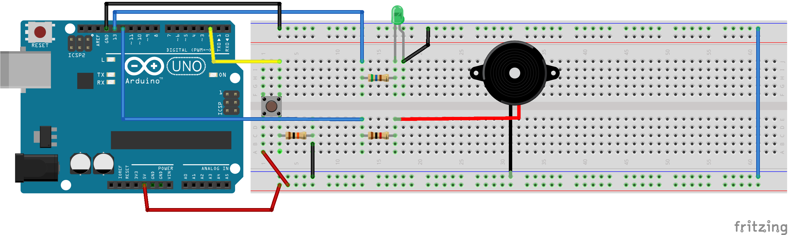

# arduino-silent-dog-whistle

Apito Ultrassônico para "calar" cães

## Controle Remoto

Qualquer controle pode ser utilizado, visto que não é decodificado nenhum
tipo de sinal.

## Atenção

Este é um projeto experimental para fins educativos.

O frequência utilizada (25KHz) incomoda mas não fere de forma alguma os cães.

## Licença

MIT
